# Awesome DSH Plugins

**自动发现、证据验证的 DeepSeek Harness 插件生态雷达。**
安装前就知道哪个插件能用、哪个要改。

   

[English](README.md) | 简体中文

---

> 扫描 1328 个候选仓库，255 个确认为 DSH 插件（clone 验证），242 个已通过 agent 运行级实测。

## 核心价值

- **找插件**：按功能领域浏览（Web UI / Agent 能力 / 编码开发 / 娱乐生活……），兼容性一目了然
- **避坑**：每个插件对当日 mainline 做四维检查（补丁 / seam / peerDeps / 编译）加运行级实测，兼容与否有证据
- **跟上变化**：每 8 小时自动对比，插件漂移实时跟踪，变化进 [CHANGELOG](CHANGELOG.md)

## 工作原理

```mermaid
graph TB
    subgraph Discovery["🔍 自动发现（每 8 小时）"]
        A1[GitHub API<br/>org: dsh-external]
        A2[GitHub Search<br/>topic: dsh-plugin<br/>topic: dsh-external]
        A3[已知列表<br/>兜底]
    end
    subgraph Validation["📋 插件验证"]
        B1{package.json<br/>name + main/exports/dsh?}
        B1 -->|通过| B2[✅ 确认插件]
        B1 -->|失败| B3[❌ 跳过非插件]
    end
    subgraph Analysis["🔬 克隆分析"]
        C1[mainline<br/>blob:none]
        C2[插件仓库<br/>depth:1]
    end
    subgraph Compat["⚖️ 四维兼容检查"]
        D1[补丁]
        D2[seam 符号]
        D3[peerDeps]
        D4[编译]
    end
    subgraph Output["📊 证据输出"]
        E1[reports/&#8203;日期/]
        E2[README<br/>分类目录]
        E3[CHANGELOG]
    end
    RT[🤖 运行级实测<br/>242 个插件]
    A1 --> B1
    A2 --> B1
    A3 --> B1
    B2 --> C1 & C2
    C1 & C2 --> D1 & D2 & D3 & D4
    D1 & D2 & D3 & D4 --> E1 & E2 & E3
    RT -.->|证据| E1
```

## 快速导航

| 你的目标 | 跳转入口 |
|---|---|
| 看热门插件 | [🔥 Star Top 20](README.md#热门插件star-top-20) |
| 按用途找 | [📋 分类目录](README.md#分类目录) — 9 大功能领域 + 兼容性状态 |
| 查证据 | [📊 当前生态快照](README.md#当前生态快照) — 日期化兼容矩阵 |
| 提交插件 | 给仓库加 `dsh-plugin` topic → 8 小时内自动收录 · [PR 模板](.github/PULL_REQUEST_TEMPLATE.md) |

> [!IMPORTANT]
> **收录不等于兼容，静态检查不等于运行可用，运行可用也不等于安全审计。**
> 本仓库提供可追溯的筛选信号，不代表 DSH 官方背书。安装第三方插件前，请检查插件源码、权限、依赖、许可证及测试日期。

---

**详细数据（分类目录 / 生态快照 / 历史报告）请看 [English 版 README](README.md)**——自动生成块（AUTO:catalog / AUTO:featured / AUTO:ecosystem）写入 README.md，中文版仅做导航与定位说明。

## 相关链接

- [PLUGINS.md](PLUGINS.md) — 人工分类和登记的精选入口
- [CHANGELOG.md](CHANGELOG.md) — 日期化生态变更摘要
- [docs/SOP.md](docs/SOP.md) — 自动化、构建与报告维护说明
- [🤖 给插件开发者](README.md#给插件开发者) — 最低收录条件、合格 README 要求
- [📖 给插件使用者](README.md#给插件使用者) — 找插件、看状态、安装验证
- [🌐 dshfind.com](https://dshfind.com) — DSH 学习与分享社区
