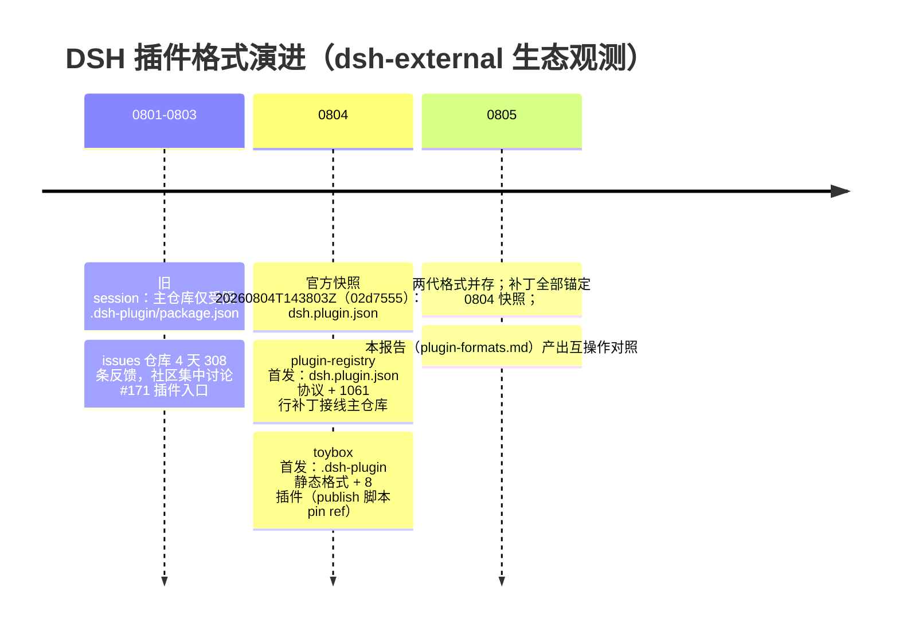

# 插件格式对照分析：.dsh-plugin/package.json（静态） vs dsh.plugin.json（动态）

> 日期：2026-08-05
> 依据：`research/toybox.md`、`research/plugin-registry.md`、`context/session-019fc8ab-summary.md`、`research/issues.md`
> 结论一句话：两代插件协议并存——`.dsh-plugin/package.json` 是主仓库快照唯一官方支持的**静态交付格式**（只承载 skill + MCP 配置，按 commit ref 不可变挂载），`dsh.plugin.json` 是 plugin-registry 独立演进的**动态生命周期协议**（同进程 import + 声明即契约 + 安装/启停/校验），二者能力面不重叠且互转有损。

---

## 1. 两种格式概览

### 1.1 `.dsh-plugin/package.json`（toybox 采用，官方静态格式）

- **协议载体**：插件目录内的 `.dsh-plugin/package.json`，字段为 `name` / `version` / `license` / `scripts.prepare` / `dsh.mcpServers`（MCP 插件）或 `dsh.skills: ["skills"]`（skill 插件）。
- **能力面**：仅 **skills**（`skills/<id>/SKILL.md`，YAML frontmatter 必含 `name` + `description`）与 **MCP 服务器**（`.dsh-plugin/.mcp.json` 声明 `mcpServers.<id>`：`type=stdio`、`command=node`、`args=["server/<id>.mjs"]`）。
- **代码形态**：MCP 服务器是**零依赖单文件 ESM（.mjs）**，由官方 `prepare.js` 在安装侧生成 `dsh-plugin-assets/.mcp.json` + `dsh-plugin.mjs` wrapper，以**子进程 + stdio 换行分隔 JSON-RPC** 与模型连通（MCP `initialize` / `tools/list` / `tools/call`）。
- **明确不支持**：任意 JS 工具、命令、hooks、Web UI 代码——官方文档指出这些能力要走开发层（workspace 包或 plugin-registry 的 `dsh.plugin.json`）。
- **挂载方式**：`~/.dsh/config.yaml` 的 `repository-plugins` 条目，source 形如 `github:dsh-external/toybox#<40位commit>&path:/plugins/<id>/.dsh-plugin`；**ref 必须是完整 40 位 commit**，更新插件 = 换 ref。

### 1.2 `dsh.plugin.json`（plugin-registry 采用，社区先行协议）

- **协议载体**：插件根目录独立清单文件 `dsh.plugin.json`，与 `package.json` 完全解耦。
- **能力面**：`contributes.{tools,skills}` 声明数组 + 入口 `main`（默认 `./index.mjs`）**同进程动态 import** 注册 Cordis 服务（工具/事件/命令/系统提示等，可 inject 官方树服务）。
- **生命周期**：`dsh plugin install <dir|tgz>`（默认禁用）→ `enable`（mount → 校验 → 持久化）→ `disable` / `uninstall`；启动时 reconcile 自动挂载已启用集。
- **校验链**：schemastery schema 校验 → `checkEngine`（semver）→ `verifyContributions`（contributes.tools 未注册即 fiber 回滚、enabled 不持久化）。
- **分发**：本地目录 / tarball（`tar.x strict:true` 防穿越）+ 本地 catalog（`plugins-catalog.json`，Obsidian 社区插件 shape，为远程 registry 预留）。

---

## 2. 逐字段对照表

| 维度 | `.dsh-plugin/package.json`（toybox / 官方静态） | `dsh.plugin.json`（plugin-registry / 动态） | 备注 |
|---|---|---|---|
| 协议载体 | `.dsh-plugin/package.json`（内嵌 `dsh.*` 字段） | 独立 `dsh.plugin.json` 清单文件 | 与 package.json 解耦，不受旧格式约束 |
| 插件标识 id | 目录路径（`plugins/<id>/`）定位，无独立 id 字段 | `id` 正则 `^[a-z0-9][a-z0-9-]*\/[a-z0-9][a-z0-9-]*$`（`publisher/name`），schema 强制 | 动态格式有命名空间；静态格式无 |
| version | `package.json#version`（semver） | 清单 `version`（semver），scaffold 默认 `0.1.0` | 均有 |
| 引擎约束 | 无 | `engines.dsh`（semver range，默认 `>=0.0.1`），`checkEngine` 不符即拒绝安装 | 动态格式独有 |
| 能力面（声明） | `dsh.mcpServers`（stdio 配置）/ `dsh.skills`（目录） | `contributes.tools` / `contributes.skills`（声明数组） | 静态：MCP 配置即能力；动态：声明需与运行时对账 |
| 代码执行 | **子进程隔离**：MCP server 以 `node server/<id>.mjs` 子进程 + stdio JSON-RPC 运行，skill 无代码 | **同进程任意代码**：`main` 动态 `import(entryUrl)`，`apply(ctx)` 拿完整 Cordis context，enable 即进程内执行 | 安全模型差异的核心 |
| 生命周期 | 静态挂载：repository-plugin 按 source 字符串缓存，无启停/卸载状态 | install（默认禁用）→ enable（mount 成功才持久化）→ disable → uninstall + 启动 reconcile | 动态格式有完整状态机 |
| 校验/门禁 | 官方 `prepare.js` 生成产物 + 仓库侧 `verify.mjs` 三段门禁（tsc、官方 prepare 冒烟、MCP 协议冒烟、frontmatter 校验） | schemastery schema + `checkEngine` + `verifyContributions`（tools 未注册回滚；skills **不校验**） | 静态靠仓库 CI，动态靠安装时校验 |
| 对账机制 | 无（声明即文件本身） | `tools.schemas()` 收集已注册工具名，contributes.tools 中未注册的列缺失名并 `fiber.dispose()` | 动态格式"声明即契约"当前仅覆盖 tools |
| 分发与安装 | `github:org/repo#<40位commit>&path:` 条目写 config.yaml | 本地目录 / `.tgz` / `.tar.gz`（strict 防穿越）+ catalog 安装，CLI 与 Web 面板双入口 | 静态走 GitHub 不可变 ref；动态走文件系统 |
| 缓存与更新 | 同一 source 字符串永久复用缓存；改代码后官方运行时**不会自动发现**，更新 = 换 ref | `index.json` 记录 `{id: {version, enabled, installedAt}}`；enable 后同版本无更新通道，**无更新命令** | 两侧都无自动更新 |
| 信任边界 | 不可变 commit ref（防篡改）+ MCP 子进程（进程外）+ skill 纯静态（无执行面） | **默认禁用 + 显式启用**是唯一信任门槛；无签名、无发布者身份、无审核、无沙箱 | 动态格式的执行面风险显著更大 |
| 原子性/并发 | 依赖 GitHub 缓存与官方加载器（失败保留最后一棵好树 + 广播 `hmr/config-update-failed`） | index 原子写（tmp+rename）+ per-`dshHome` Promise 链串行锁 + install 失败回滚目录 | 动态格式注册表一致性契约更完整 |
| 官方对齐 | 对齐 0804 快照：`prepare.js` 拷贝、SKILL.md frontmatter 规范、tsconfig 选项 | 补丁锚定 0804 快照（1061 行 / 30 文件），peer 依赖全为 `@deepseek-ai/dsh-*` workspace 包 | 两者都绑定单一快照，基线漂移即失效 |
| 测试形态 | vitest + 共享 stdio MCP 测试客户端（换行分隔 JSON-RPC） | 8 个核心 spec + apiproxy 端 150 行 spec + UI 面板 spec | 均有测试，动态格式覆盖面更大 |

---

## 3. 互操作分析

### 3.1 能否互相转换

**方向 A：`.dsh-plugin/package.json` → `dsh.plugin.json`（静态 → 动态）——可行但有损，且工作量大**

- **skill 插件**：`dsh.skills: ["skills"]` + `SKILL.md` → `contributes.skills: [...]` 声明。SKILL.md 本体可直接复用（frontmatter 规范同源），仅需重写声明与打包为清单目录。
- **MCP 插件**：不能直接搬。静态格式的 MCP server 是**子进程 stdio 协议**；动态格式要求 `main` 导出 Cordis 插件并在进程内注册 `ctx.tools`。转换路径有两种：
  1. 保留 .mjs server 不动，在 `index.mjs` 里包一个**进程内 stdio MCP 客户端**（spawn 子进程 + JSON-RPC），把工具逐一手工桥接进 `ctx.tools.register`——MCP 协议层复用，但每个工具要写胶水；
  2. 把工具逻辑重写为进程内函数直注册——丢掉 MCP 协议层，改造量最大但最"原生"。
- **有损点**：静态格式的 MCP 能力边界（工具集由 server 自报）在动态格式下变成 `contributes.tools` 静态声明 + 挂载时对账，**工具清单必须在注册前已知**；对账失败会整体回滚挂载。

**方向 B：`dsh.plugin.json` → `.dsh-plugin/package.json`（动态 → 静态）——仅能力子集可行**

- 仅当插件只用 `contributes.skills`（纯 skill 声明）时可无损转：`dsh.plugin.json` + `skills/` → `.dsh-plugin/package.json` + `skills/<id>/SKILL.md`。
- 一旦用到 `main` 动态 import（工具/事件/命令/系统提示/hooks/Web UI），**静态格式无承载面**，无法转换——这正是两代格式的能力鸿沟：静态格式是"配置分发"，动态格式是"代码分发"。

### 3.2 建议迁移路径

1. **skill 类插件**：双向可转，迁移成本最低，优先做格式兼容（例如 plugin-registry 的 scaffold 增加 `.dsh-plugin` 导出模式）。
2. **MCP 类插件**：以"进程内 stdio MCP 客户端桥接"为过渡路径，保留 server 单文件产物与协议测试（toybox 的 `tests/lib/mcp-client.ts` 可直接复用），后续再决定是否内联为原生工具。
3. **动态能力插件（工具/事件/命令）**：只能留在 `dsh.plugin.json` 侧；静态格式无对应物。
4. **目录级兼容**：一个插件包可同时携带两份清单（`.dsh-plugin/package.json` + `dsh.plugin.json`），由安装方式决定走哪条加载链——是成本最低的并存期方案，但需两个入口的维护纪律。

### 3.3 主仓库现状关系

- **旧 session 结论（`context/session-019fc8ab-summary.md`）**：主仓库快照（`02d7555`，snapshots/20260804T143803Z）只支持受限的 `.dsh-plugin/package.json` 格式；repository-plugin 按完整 commit ref 挂载（`github:...#<40位commit>&path:`）；群聊宣称的 `dsh.plugin.json` 插件系统**不在快照中**。
- **plugin-registry 的补丁集成**：`dsh.plugin.json` 协议通过 1061 行补丁（`patches/dsh-plugin-registry.patch`，锚定 0804 快照）接线进主仓库——`plugin-local` 进 cordis 树、`dsh plugin` CLI 子树、apiproxy `plugins` RPC 域、Web 管理面板。**不是 Loader 配置树的一部分**（不进 cordis.yml 组合输出），是官方树之上的第二层。
- **两代并存是生态关键事实**：toybox（静态）与 plugin-registry（动态）同属 dsh-external org，8 月 4-5 日密集首发；issues#171「插件系统暴露标准入口，定义分发与贡献机制」（308 个 issue 中评论最多，7 条）正是社区对统一协议入口的诉求——当前两代格式并存、互转有损，正是该 issue 迟迟未闭环的生态侧证据。
- **能力边界对应关系**：官方 `.dsh-plugin` 静态格式 = "skill + MCP 配置"；plugin-registry `dsh.plugin.json` = "任意 Cordis 服务端/Web UI 代码"。主仓库快照缺的"开发层插件分发"，由 plugin-registry 补上，但代价是补丁锚定 + 同进程执行面。

---

### 3.4 典型迁移示例（以 toybox 的 MCP 插件为例）

以 `almanac-mcp`（老黄历，3 个工具，零依赖 .mjs）为例走一遍方向 A 迁移：

1. **保留**：`src/almanac.mts` 源码、`tests/*.spec.ts`（vitest + 共享 MCP 测试客户端）、tsconfig 严格选项——这些与格式无关；
2. **重写**：把 `.dsh-plugin/` 目录替换为 `dsh.plugin.json`（`id: almanac/almanac-mcp`、`main: ./index.mjs`、`contributes.tools: [yi_ji, chou_qian, tang_shi]`）+ `index.mjs`（Cordis 插件：`apply(ctx)` 内逐工具 `ctx.tools.register`）；
3. **两种实现**：① 进程内 stdio MCP 客户端桥接（spawn 原 .mjs + JSON-RPC，工具注册做薄封装，协议测试可复用）；② 把 14.9KB 算法内联为纯函数直注册（丢掉 MCP 层，最彻底）；
4. **风险点**：`contributes.tools` 声明必须在注册前静态已知——MCP 版的"工具由 server 自报"不再成立；工具名拼写不一致会导致 `verifyContributions` 回滚挂载。

**skill 插件（如 code-archaeologist）迁移则几乎无损**：`SKILL.md` 本体不动，仅把 `dsh.skills` 目录声明换成 `contributes.skills` 数组，frontmatter 规范同源（均对齐官方 0804 快照文档）。

### 3.5 格式演进时间线（生态事实）

关键事实链：旧 session 确认主仓库快照只支持 `.dsh-plugin/package.json`（repository-plugin 按完整 commit ref 挂载，改代码不自动发现）→ plugin-registry 以独立 `dsh.plugin.json` 补上开发层能力（动态 import + 生命周期 + 对账），但**不进 Loader 配置树**（不出现在 cordis.yml 组合输出）→ 两代格式在能力面互补、互转有损，生态层尚未统一（#171 仍 open）。

---

## 4. 结论与建议

1. **两代格式短期必须并存**：静态格式是主仓库唯一官方通道（零代码、按 ref 不可变、子进程隔离），动态格式是唯一能承载工具/命令/Web 能力的通道；互相替代在能力面上不成立。
2. **统一入口的落点应在动态格式**：issues#171 的诉求（标准入口 + 分发 + 贡献机制）只能由 `dsh.plugin.json` 满足；静态格式应作为动态格式的"导出/兼容子集"存在，而非反向。
3. **补丁锚定是共同债务**：两份集成（toybox 的 prepare.js 拷贝 / plugin-registry 的 1061 行补丁）都绑定 0804 快照，主仓库基线一漂即批量失效——建议推动主仓库把 `dsh.plugin.json` 协议官方化，从补丁升级为上游能力。
4. **安全模型差异要写进决策**：动态格式 enable 即同进程任意代码执行（无沙箱/签名/发布者身份），静态格式天然无此问题；任何"格式统一"提案都需先回答插件信任与审核问题（详见 `analysis/security-issues.md`）。
